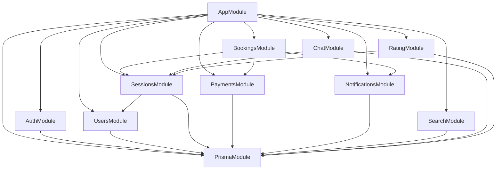

# ShuttleUp — System Architecture

> **Last Updated:** April 16, 2026 | **Status:** Phase 0 (Infrastructure Ready)

## Architecture Style

**Modular Monolith** — all backend modules run in a single NestJS process with clear module boundaries. This approach is ideal for a solo developer because:

- Single deploy, single process → easy debugging
- NestJS module boundaries enable future microservice extraction
- Shared database with Prisma ORM for type-safe queries
- Async workloads (notifications) offloaded to Bull Queue via Redis

## System Topology

```
┌──────────────────────────────────────────────────────────────┐
│                      CLIENT LAYER                            │
│                                                              │
│  ┌──────────────┐  ┌──────────────┐  ┌──────────────────┐   │
│  │  Next.js 16  │  │ Flutter 3.10 │  │     Admin        │   │
│  │  Web App     │  │  Mobile App  │  │   Dashboard      │   │
│  │  (Vercel)    │  │  iOS/Android │  │   (Next.js)      │   │
│  └──────┬───────┘  └──────┬───────┘  └────────┬─────────┘   │
└─────────┼─────────────────┼───────────────────┼─────────────┘
          │           HTTPS / WebSocket          │
          └─────────────────┼───────────────────┘
                            ▼
┌──────────────────────────────────────────────────────────────┐
│               NestJS API (Railway / VPS)                      │
│          JWT Auth Guard · Rate Limiting · CORS                │
└──────────────────────────┬───────────────────────────────────┘
                            ▼
┌──────────────────────────────────────────────────────────────┐
│               BACKEND MODULES (Modular Monolith)             │
│                                                              │
│  ┌──────────┐ ┌──────────┐ ┌──────────────┐ ┌───────────┐  │
│  │  Auth    │ │ Session  │ │   Booking    │ │  Notif.   │  │
│  │ BetterA. │ │CRUD+Slot │ │  + Payment   │ │Bull Queue │  │
│  └──────────┘ └──────────┘ └──────────────┘ └───────────┘  │
│  ┌──────────┐ ┌──────────┐ ┌──────────────┐ ┌───────────┐  │
│  │  Users   │ │  Search  │ │    Chat      │ │ Rating    │  │
│  │ Profile  │ │ PostGIS  │ │  WebSocket   │ │ ELO Score │  │
│  └──────────┘ └──────────┘ └──────────────┘ └───────────┘  │
└──────────────────────────┬───────────────────────────────────┘
                            ▼
┌──────────────────────────────────────────────────────────────┐
│                       DATA LAYER                             │
│                                                              │
│  ┌──────────────┐  ┌──────────────┐  ┌──────────────────┐   │
│  │ PostgreSQL   │  │    Redis     │  │  Cloudinary/S3   │   │
│  │ 16 + PostGIS │  │  7-alpine   │  │  Images/Media    │   │
│  │ Prisma ORM   │  │ Cache+Queue │  │                  │   │
│  └──────────────┘  └──────────────┘  └──────────────────┘   │
└──────────────────────────┬───────────────────────────────────┘
                            ▼
┌──────────────────────────────────────────────────────────────┐
│                   EXTERNAL SERVICES                          │
│                                                              │
│  ┌──────────────┐  ┌──────────────┐  ┌──────────────────┐   │
│  │ VNPay / MoMo │  │ Zalo OA+FCM  │  │ Google Maps API  │   │
│  │ Webhook+Refund│  │Push+Message │  │Geocoding+Nearby  │   │
│  └──────────────┘  └──────────────┘  └──────────────────┘   │
└──────────────────────────────────────────────────────────────┘
```

## Module Dependency Graph



## Database Schema (ER Overview)

```
USERS ──|--o{ SESSIONS       : "hosts"
COURTS ──|--o{ SESSIONS      : "used in"
SESSIONS ──|--o{ BOOKINGS    : "has"
USERS ──|--o{ BOOKINGS       : "makes"
BOOKINGS ──|--o{ PAYMENTS    : "triggers"
PAYMENTS ──|--o{ PAYMENT_LOGS : "logged in"
SESSIONS ──|--o{ RATINGS     : "after"
SESSIONS ──|--o{ MESSAGES    : "has"
```

### Core Tables

| Table | Purpose | Key Fields |
|-------|---------|-----------|
| `users` | Player/host accounts | id, full_name, phone, email, skill_level, elo_score |
| `courts` | Badminton court locations | id, name, address, lat, lng, district, city |
| `sessions` | Play sessions (single or recurring) | id, host_id, court_id, start_time, total_slots, price, skill_required |
| `bookings` | Player registrations | id, session_id, user_id, status, amount_paid |
| `payments` | Transaction records | id, booking_id, provider, amount, type, status |
| `ratings` | Post-session reviews | id, session_id, rater_id, ratee_id, score |

### Key Indexes

| Index | Purpose |
|-------|---------|
| GiST on `courts(lat, lng)` | Geo-spatial nearby search |
| Composite on `sessions(start_time, status)` | Feed query performance |
| Composite on `bookings(user_id, status)` | User booking lookup |
| Partial on `notifications(user_id, is_read)` | Unread count optimization |

## Authentication Flow

```
┌──────────┐     ┌──────────┐     ┌──────────────┐
│  Client  │────►│ Better   │────►│  PostgreSQL  │
│ Web/App  │     │   Auth   │     │  Users table │
└──────────┘     └──────────┘     └──────────────┘
     │                │
     │  JWT Token     │  Session stored
     ▼                ▼
  localStorage    Server-side
  (Web) /         session mgmt
  SecureStorage
  (Mobile)
```

- **Strategy:** Better Auth with email + Google OAuth
- **Guest flow:** Anonymous plugin (name + phone only, no account)
- **Token:** JWT with refresh rotation
- **Guards:** NestJS `@UseGuards(JwtAuthGuard)` on protected endpoints

## Booking State Machine

```
                    ┌──────────────────┐
                    │ pending_payment  │
                    └────────┬─────────┘
                             │ Payment received
                             ▼
                    ┌──────────────────┐
               ┌───│ pending_approval │───┐
               │   └──────────────────┘   │
     Auto-approve                    Host reviews
               │                          │
               ▼                     ┌────┴────┐
        ┌──────────┐                 ▼         ▼
        │ confirmed │           confirmed   cancelled
        └─────┬─────┘                      (auto-refund)
              │
       Session ends
              ▼
        ┌──────────┐
        │ attended  │
        └──────────┘
```

## Notification Pipeline

```
Event occurs (booking, approval, etc.)
        │
        ▼
  Bull Queue (Redis)  ←── async, non-blocking
        │
        ├──► Email (Resend API)
        ├──► Push (Firebase Cloud Messaging)
        └──► Zalo OA (Vietnam-specific, fallback)
```

## Key Technical Decisions

| Decision | Choice | Rationale |
|----------|--------|-----------|
| Monolith vs Microservices | Modular Monolith | Solo dev productivity, easy debugging |
| ORM | Prisma | Type-safe, migration-friendly, good DX |
| Auth | Better Auth | TypeScript-native, simpler than NextAuth for API |
| Geo Search | PostGIS + GiST | Native PostgreSQL, no external service needed |
| Queue | Bull (Redis) | Proven async job processing for notifications |
| Real-time | Socket.IO | WebSocket with fallback, good Flutter support |
| Slot Locking | Redis atomic ops | Prevents overbooking race conditions |

## Security Considerations

- JWT tokens with short expiry + refresh rotation
- Rate limiting on auth endpoints (throttle guard)
- CORS configured per environment
- Input validation via class-validator DTOs
- Prisma parameterized queries (SQL injection prevention)
- Secrets in `.env` files, never committed
- Webhook signature verification for payment callbacks

## Scaling Path (Future)

1. **Vertical:** Increase Railway instance resources
2. **Read replicas:** PostgreSQL read replicas for search queries
3. **CDN:** Vercel edge for web static assets
4. **Cache:** Redis caching for session feed (5-min TTL)
5. **Module extraction:** Extract notifications → independent service if needed
